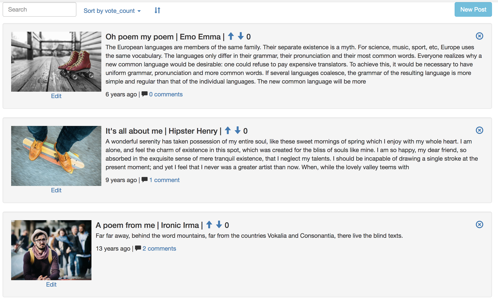
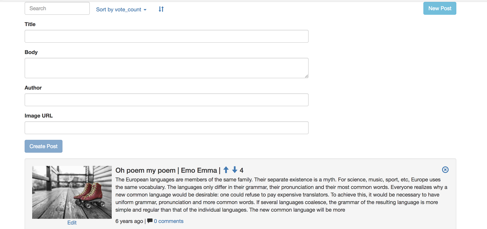
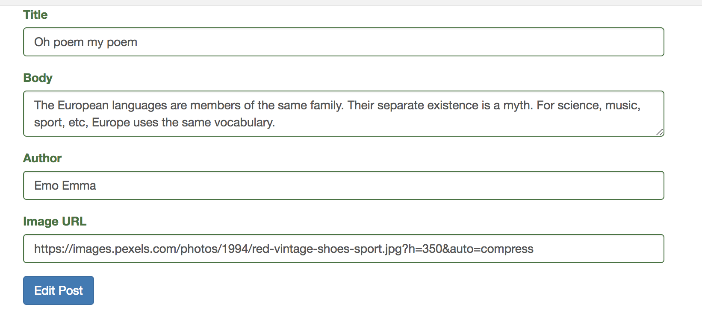
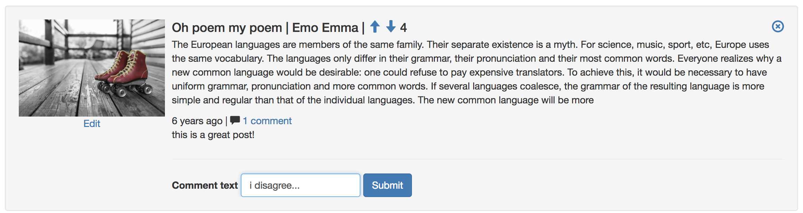

# RedditClone
Demo social site to highlight the abilities of AngularJS (v1.6).


Users can create, edit, and delete posts.



Users can also vote or comment on existing posts similar to reddit.


## Getting Started
Clone the repository, install the required dependencies, and launch the server:
```
git clone https://github.com/wittrura/reddit-clone.git
cd reddit-clone/
npm install
npm start
```
The server will run on port 5000 by default.

### Prerequisites
PostgreSQL - after install, the script file will create the required databases in Postgres and seed the tables.

### Installing
Additional information regarding installing Postgres is available at [the Postgres website](https://www.postgresql.org/download/). There are both command line and GUI options.

<!-- ### Running the tests
Explain how to run the automated tests for this system -->

<!-- ### Break down into end to end tests
Explain what these tests test and why

```
Give an example
``` -->

<!-- ### And coding style tests
Explain what these tests test and why

```
Give an example
``` -->

## Deployment
This project is currently set up to be deployed on Heroku, and a live link is included in the project description.

To deploy, the [Heroku Postgres add-on](https://elements.heroku.com/addons/heroku-postgresql) must be installed on your dyno.

## Built With
* [AngularJS](https://angularjs.org/) - The superheroic Javascript MVW framework
* [Node](https://nodejs.org/en/) - Backend server
* [Express](http://expressjs.com/) - Backend server, routing, middleware
* [Knex](http://knexjs.org/) - SQL query builder
* [PostgreSQL](https://www.postgresql.org/) - SQL database
* [Protractor](http://www.protractortest.org/) - E2E testing for Angular
* [Mocha](https://mochajs.org/) - server-side API testing
