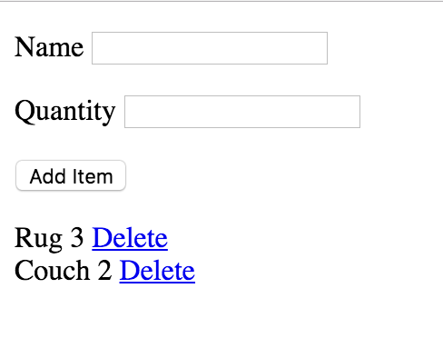

# Managing lists

Create an Angular application that allows users to manage items in a shopping cart.



## Requirements

This app manages items, that look like this:

```js
{name: "some name", quantity: 4}
```

- When the app loads there should be 2 items in the list
- When the user fills in the name/quantity field and submits the form:
  - The item should be added to the list
  - The form should be cleared
- When the user clicks delete on an item the item should be removed from the list

NOTE: in order to work with the tests, use the properties `item` and `items` (as you would in real life).

## Setup

Run `yarn` and `npm start` to see the app locally.

Run `npm test` to run the tests.

> Check the "test/screenshots" folder for examples of what each test is looking for.

## Coding standards

Recall the 4-step process for setting up basic Angular applications:

1. Define and wire up a Module (probably called "app")
1. Define and insert a Component
1. Define the component's Controller with event handlers
1. Define the component's Template

## HTML starter

Here's the basic HTML to start with:

```html
<form>
  <p>
    <label for="name">Name</label>
    <input id="name">
  </p>
  <p>
    <label for="quantity">Quantity</label>
    <input id="quantity">
  </p>
  <p>
    <button type="submit">Add Item</button>
  </p>
</form>

<div class="item">
  <!-- fill this in -->
  <a href="#">Delete</a>
</div>
```
