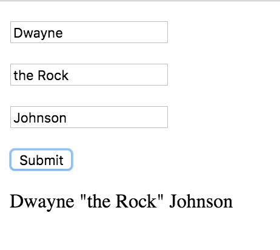
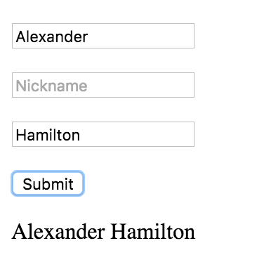

# Creating a simple interactive Angular application

Create an Angular application that allows users to format names.

Your application should have 3 fields, each bound to a property on the controller:

- First name (`firstName`)
- Nickname name (`nickname`)
- Last name (`lastName`)

When the user clicks the "Submit" button it should display the formatted name, according to these rules:

- If there is a `nickname`, then surround the `nickname` by quotes

  

- If there is no nickname, then just show the `firstName` and `lastName`

  

## Setup

Run `yarn` and `npm start` to see the app locally.

Run `npm test` to run the tests.

## Coding standards

Recall the 4-step process for setting up basic Angular applications:

1. Define and wire up a Module (probably called "app")
1. Define and insert a Component
1. Define the component's Controller with event handlers
1. Define the component's Template

## HTML starter

Here's the basic HTML to start with:

```html
<p><input placeholder="First Name"/></p>
<p><input placeholder="Nickname"/></p>
<p><input placeholder="Last Name"/></p>
<p><button>Submit</button></p>

<p><!-- show name here --></p>
```
