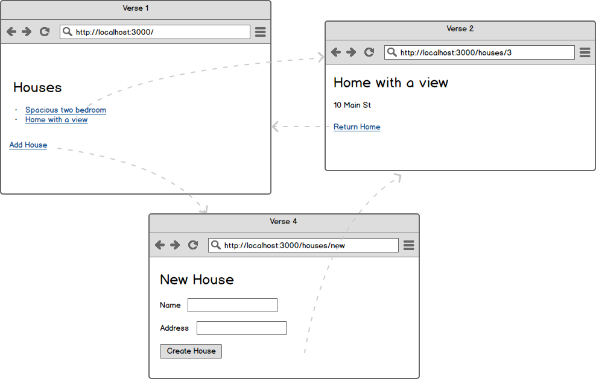

# Routes with ui-router

Create an Angular application that allows a user to navigate between different routes.

## Requirements

- When a user clicks on "Add House" then:
  - The URL should be `/houses/new`
- When a user clicks "Create House" then:
  - They should be redirected to `/houses/1` (where `1` is whatever the house id is)
- When a user visits the homepage then
  - They see the house listed
- When a user clicks on a house, then:
  - The URL should be `/houses/4` (where `4` is the house id)
- When a user visits `/houses/4` then
  - They should see the house address
  - They should be able to return to the homepage

The app should use clean URLs (no hashtags).

## Setup

Run `yarn` and `npm start` to see the app locally.

Run `npm test` to run the tests.

## Hint

Search the project for `TODO` to help you find some of the places where you need to make changes.

## Coding standards

Recall the 6-step process for configuring ui-router:

1. Include the script tag
1. Register the module
1. Define a route
1. Add `<ui-view>` to your HTML file
1. Add the `<base>` tag to your HTML file
1. Turn on `html5Mode`
